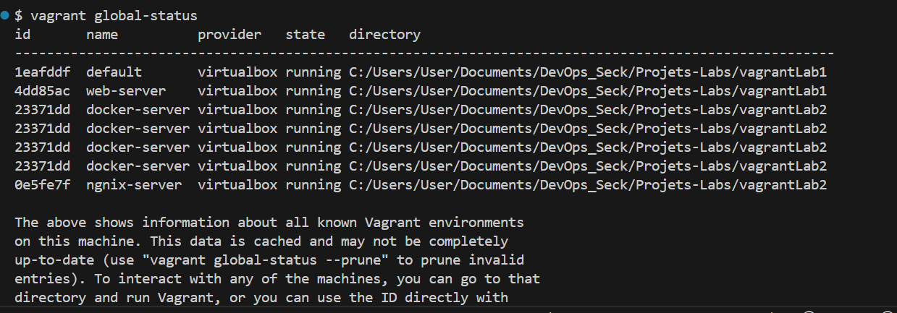
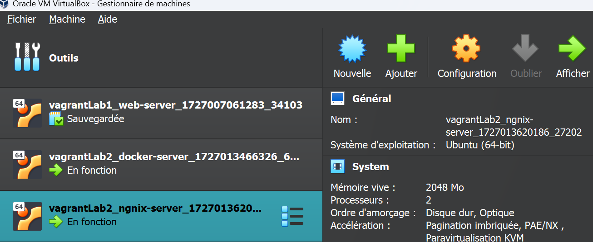

# TP2 Lab 2 en vagrant

# Créer un repo dans github
# Créer un projet vagrant
# Avec votre vagrantfile créer deux VMs
# Le premier doit porter comme nom : server et le deuxième : client
# Dans la premiere, vous devez y installer docker
# Dans la deuxième aussi vous devez y installer nginx

### Project runing

# ----------------------------------------------------------------------------------------- #
